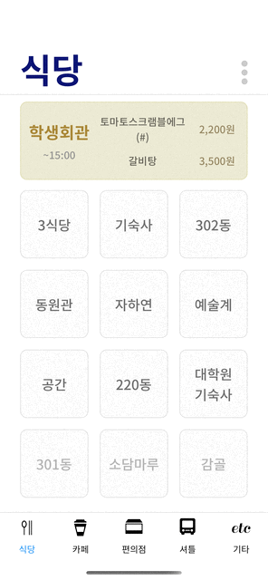

# iSNU

> 서울대학교 학내 편의시설 운영 정보 제공 모바일 앱

## Usage

## Stack:

- Development: JavaScript(ES6), ReactNative, NativeBase
- Collaboration: Git, Github, Slack, Notion
- Design: Figma
- User Analysis: Amplitude

## Channel:

- [Notion](https://www.notion.so/iSNU-f3c4210813ff4f8e826a5fd7ce8141fa)
- [iOS App Store](https://apps.apple.com/app/id1492654572)
- [Google Play Store](https://play.google.com/store/apps/details?id=com.snuinfo)
- [Github](https://github.com/workasahobby/iSNU)
